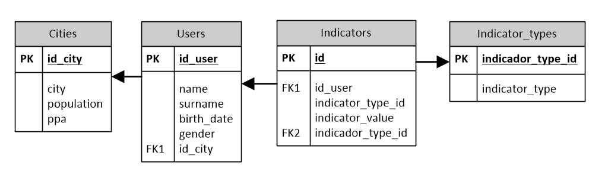

# Test Data Engineer

## TEMA 1: Python

#### Pregunta 1. Escribe un programa en python que valide si una palabra es palíndrome o no (palíndrome: palabra que se lee igual en ambos sentidos. Ej. radar)

#### Pregunta 2. Dada la clase Perro, definida en el código siguiente, crea una clase llamada Quiltro, heredada de la clase Perro y sobrecarga el método speak() usando un sonido especifico para el Quiltro (Ej. "guau"). 

```python
class Perro:
    def __init__(self, name, age):
        self.name = name
        self.age = age

    def speak(self, sound):
        return f"{self.name} says {sound}"  
```

#### Pregunta 3. Escribe una función en python que reciba un número n y entregue una lista con una serie de fibonacci hasta el número n. Luego escribe un generador que entregue un iterador de números de fibonacci hasta el número n. Finalmente decora ambas funciones con un wrapper que agregue a la salida el tiempo de ejecución de la función y compara los tiempos de ejecución. (Serie de fibonacci es una serie matemática donde cada número es el resultado de la suma de los 2 anteriores: 0, 1, 1, 2, 3, 5, 8, 13, 21...)

#### Pregunta 4. El siguiente código recorre de forma secuencial un listado de sitios web y despliega su longitud. A través del uso de la librería asyncio transforma el código para que los distintos request se ejecuten de manera asíncrona. Agrega en la salida el tiempo del proceso completo y compara la duración usando el método original vs el método asíncrono.

```python
import requests

sites = ["http://quotes.toscrape.com/tag/love/",
         "http://quotes.toscrape.com/tag/inspirational/",
         "http://quotes.toscrape.com/tag/life/",
         "http://quotes.toscrape.com/tag/humor/",
         "http://quotes.toscrape.com/tag/books/",
         "http://quotes.toscrape.com/tag/reading/"]

def download_site(url, session):
    with session.get(url) as response:
        print(f"Read {len(response.content)} from {url}")

def download_all(sites):
    with requests.Session() as session:
        for url in sites:
            download_site(url, session)

if __name__=="__main__":
    download_all(sites)
```

## TEMA 2: SQL

#### Pregunta 1. De acuerdo a la base de datos descrita en el siguiente diagrama, escribe una query que entregue como resultado el total de usuarios de la ciudad de Santiago.



#### Pregunta 2. Para la misma base de datos, supongamos que uno de los tipos de indicadores de la tabla 'Indicator_type' es 'height', que representa la altura (cm) de un usuario dado. Escribe una query en SQL para obtener la ciudad donde la altura promedio de sus usuarios es la mayor.

#### Pregunta 3. Escribe una query similar a la anterior pero ahora busca la ciudad donde la altura promedio de sus usuarios es la tercera mayor, considerando únicamente las ciudades que tengan más de 1000 usuarios.

#### Pregunta 4. Supongamos que la tabla 'Indicators' de la base de datos descrita en la pregunta anterior acumula 40 millones de registros. Nombra 5 estrategias distintas que utilizarías para optimizar el desempeño de la base de datos en general. Intenta describir en detalle la acción a realizar (ej. qué columnas específicas manipularas) y que tipo de queries podrían mejorar su desempeño (consulta o modificación). Toma como supuesto que inicialmente la base de datos está en el mismo servidor que la aplicación, es una base MySQL con motor InnoDB y es necesario que la base de datos se mantenga como una base relacional.


## TEMA 3: Cloud and Networking

#### Pregunta 1. Explica el propósito de al menos 4 tipos de requests HTTP cuando éstos son utilizados para consultar una API tipo Restful

#### Pregunta 2. Diseña una versión simplificada de Twitter, donde usuarios puedan: 1. postear, 2. seguir a otros usuarios y 3. poder visualizar el timeline. Los requerimientos son: 1. alta disponibilidad, 2. alto volumen de usuarios y tweets, 3. actualización de mensajes en muy poco tiempo. Para el diseño, sigue la siguiente pauta:

- a. Escribe todas las preguntas que necesites hacer, que creas que sean relevantes para un diseño inicial tipo MVP. Así mismo escribe todos los supuestos que estés asumiendo para este diseño. 
- b. De acuerdo a los requerimientos describe una arquitectura básica para la base de datos.
- c. Dibuja un diseño de alto nivel (usuario, servidores, bases de datos, etc). Justifica tus decisiones considerando los requerimientos expuestos. 
- d. En una etapa posterior al MVP, qué herramientas utilizarías para la implementación de la funcionalidad Trending Topic 
	
